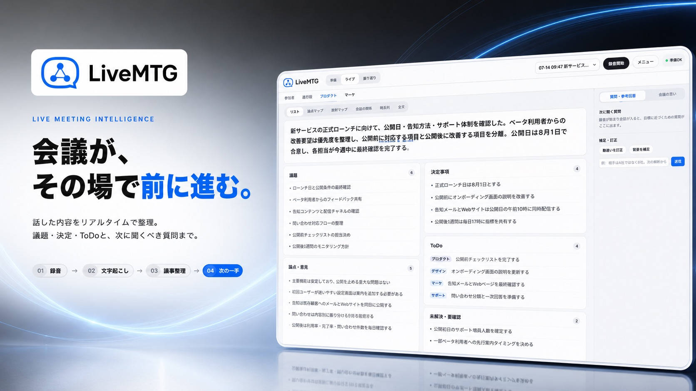

# LiveMTG

[](https://www.npmjs.com/package/live-mtg) [](LICENSE) [](https://github.com/sponsors/Sponsaru)




**会議前・会議中・会議後を、ひとつにつなぐ。**

LiveMTGは、会議前の壁打ちから、会議中の議題追跡とAI支援、会議後の清書・可視化・共有資料までをひとつにつなぐ、ローカル実行型のAI会議ワークスペースです。Claude CodeまたはCodexを使い、録音から現在の議題、合意、次に聞く質問、会話構造のマップ、共有用PDFまでを整理します。

> **English is supported.** During `live-mtg onboard`, choose English, or switch anytime with `live-mtg config --language en`. The dashboard, English transcription, AI analysis, meeting preparation, web research, mind maps, and slides will all use English. Switch back with `live-mtg config --language ja`.

> **配布方式**：OpenClawと同じく、主経路はnpmのグローバルCLI＋オンボーディング＋常駐サービス。Mac用DMG/Windowsアプリは補助経路として [`desktop/`](desktop/) に残す。

## インストール（OpenClaw方式）

```bash
npm install -g live-mtg
live-mtg
```

初回の `live-mtg` が自動でオンボーディングを開始し、AI選択、選択したCLIのインストールとログイン、ffmpeg・文字起こし環境の準備、常駐起動まで順番に案内する。設定をやり直す場合だけ `live-mtg onboard` を使う。

CIやAIエージェントなどstdinが使えない非対話環境では、意図しないインストールを防ぐため初期設定を自動承認しない。必要なツールの導入・モデル取得・常駐化を承認する場合は次を使う（AI CLIへのログインは事前に完了させる）。

```bash
live-mtg onboard --yes --provider claude --language ja
# 常駐化しない場合
live-mtg onboard --yes --no-daemon --provider codex --language ja
```

初期設定で **Claude Code / Codex** を選ぶ。選択は `~/.live-mtg/config.json` に保存され、会議のライブ整理・事前準備・Web調査・清書・成果物生成のすべてで同じAIを使う。

```bash
# あとから切り替える場合（常駐プロセスも自動で再起動）
live-mtg config --provider codex
live-mtg config --provider claude
```

選択するAIは、ユーザー自身のPCで先にインストール・ログインする。LiveMTGへAPIキーを登録する必要はない。

```bash
# Codexを使うユーザー
npm install -g @openai/codex
codex login

# Claude Codeを使うユーザー
npm install -g @anthropic-ai/claude-code
claude auth login

# 最後に確認
live-mtg doctor
```

配布サイトを用意した後は、次の1行インストーラーも使える：

```bash
curl -fsSL https://<配布ドメイン>/install.sh | bash
```

Windows PowerShell:

```powershell
iwr -useb https://<配布ドメイン>/install.ps1 | iex
```

Windows PowerShell 5.1で日本語出力をパイプやファイルに渡す場合は、実行前に出力エンコーディングをUTF-8にする。`install.ps1` 経由では自動設定される。

```powershell
$utf8 = New-Object System.Text.UTF8Encoding($false)
[Console]::InputEncoding = $utf8
[Console]::OutputEncoding = $utf8
$OutputEncoding = $utf8
live-mtg doctor | Out-File -Encoding utf8 .\live-mtg-doctor.txt
```

日常操作は `live-mtg dashboard`、診断は `live-mtg doctor`、更新は `live-mtg update`。不具合時は `live-mtg logs`、会議本文を含まない診断書は `live-mtg report`、旧版へ戻すには `live-mtg rollback`。バックグラウンド起動ではMac・Windowsともサーバー出力を `~/.live-mtg/server.log` に保存し、5MBごとに3世代ローテーションする。Windowsでは監視プロセスがサーバーの異常終了を検知し、最大30秒間隔で自動復旧する。npm公開前はこのフォルダで `npm link` すれば同じ導線をローカル検証できる。

作者のリリースは、初回のみnpmへ手動公開してパッケージ名を作成する。以後はnpm側でGitHub Actionsの `npm-release.yml` をTrusted Publisherに指定し、`package.json`のversionを上げて同じversionのGitタグをpushする。長期保存の`NPM_TOKEN`は使わない。

**準備**で着地点・議題・質問を組み立て、**ライブ**で現在の議題、質問と意図、合意状態、AI支援を更新。終了後は **振り返り** から高精度清書、学びと次の一手、会話マップ、会議ペーパー・スライドPDFまで作成できる。

## 主な機能
- **リアルタイム議事整理**：発話の切れ目ごとに議題・論点・決定・ToDo・未解決へ自動仕分け
- **可変長チャンク（VAD）**：固定秒で切らず、**無音を検知した所で区切る**（文の途中で切らない＝文字起こし精度↑。無音区間は送らない）
- **会議後の一括清書**：保存した全音声を1本に結合し、**分断なしで whisper→claude 整理し直す高精度版**（📋 清書）。ライブは進行の目安、清書は正式議事録の二段構え。※結合後の文字起こしは**15分超なら5分刻みに分割して独立デコード**（v54〜。長尺を1本でデコードすると途中で脱線し以降が反復崩壊する whisper の癖への対策。2026-07-14 実障害）
- **終了済み録音の取り込み**：m4a・mp3・wav・webm等を新しい会議として追加し、通常の文字起こし・議題整理・決定／次の行動・4種類の可視化へ自動投入。長時間ファイルはメモリへ全展開せず保存し、アップロード進捗と解析状況を画面に表示する
- **AIサポート（💡）**：会話から「〜って一般的に何？」「他社はどうしてる？」等の**疑問・要調査・意見が欲しそうな論点を自動検出し、補足を表示**。断定せず「一般には〜と言われる」の留保付き、固有・最新・数字は「⚠要確認」明示。バブルの「🔎Web検索で確認」で出典付き裏取りも可
- **🎯 商談ガイド（参謀モード）**：会議に**目標**と**背景フォルダ**を設定すると、①開始時にAIがフォルダをClaude Code式に探索してダイジェスト＋ファイルマップ化 ②会話の流れ×目標×背景を踏まえた**次の質問の提案（意図つき）**と**相手の発言の解析（本音・懸念・シグナル）**を常時更新 ③回答に資料の詳細が要るとAIが判断したら**自動で背景フォルダへ調べに行く**（並行実行・ライブは止まらない・結果は次サイクルで合流）。画面は畳んだ「🎯ガイド」バー→困った時にタップで展開
- **プロフィール（私は誰か・2026-07-13）**：メニュー「プロフィール」で**一問一答**（名前／会社・役職／補足）に答えるだけ（回答=`profile.json`・AI注入用=`profile.md`・全会議共通）。プロフィールは依頼主の文脈と助言に使うが、音声内の話者名を確定する根拠にはしない
- **背景フォルダ探索の安全対策（2026-07-13）**：探索・自動下調べのAIは**背景フォルダの外に出ない**（プロンプトで厳守指示＋ユーザー設定のPreToolUseフックがドライブルート起点の再帰検索を機械ブロック）。タイムアウト時は**プロセスグループごと殺す**ので検索コマンドが孤児で暴走しない（旧実装は孫grepが生き残り2時間CPU400%暴走する実障害があった）。背景フォルダには kenshin/ ルートではなく案件フォルダ（`gyomu-ai/estimate/` 等）を選ぶこと
- **どのフォルダからでも起動**：`mtg` コマンド（`~/.local/bin/mtg`）。`cd ~/kenshin/invest && mtg "定例" --goal "..."` でカレントフォルダを背景にした会議が開く。画面の「＋新規会議」でも背景フォルダを指定可（📁ネイティブ選択・最近の候補）
- **📚 用途別プレイブック（使うほど賢くなる）**：会議に「用途」（商談/採用面接/ヒアリング等）を設定すると、`playbooks/<用途>.md` の蓄積ノウハウをガイドが参照。会議後にメニュー「📚学びを抽出」→AIが一般化された学び（刺さった/滑った打ち手・反応パターン）を抽出→**承認・編集してから追記**。ノウハウは**フォルダでなく用途に紐づく**ので、どの案件で使っても集約され、案件フォルダが空でも用途の知恵は付いてくる。プレイブックは共有ドライブ内＝手での編集・追記も歓迎
- **リアルタイム作図**：話に出た流れ・相関・体制を Mermaid 図でライブ描画（スライド表示）
- **録音の動作保証表示＋低遅延レーン**：録音開始直後から「マイク入力→サーバー保存→文字起こし」を実測で順に表示。文字起こし結果はAIを待たず即時表示し、録音中は背景探索・詳細整理を一時停止して要約・決定・次の質問・関係差分を最優先する。詳細マップと自動調査は録音停止後に再開する（会議中に明示した「調べて」は即時実行）
- **リアルタイム匿名話者分離＋清書前確認（Mac・任意）**：`whispermlx` / pyannoteを文字起こし・AI解析とは別の常駐レーンで動かし、録音中にSpeaker A/Bを暫定表示する。全音声の再評価時は時間重なりでラベルを固定し、A/Bが更新ごとに入れ替わらない。清書前に発言例を見て名前を任意入力し、確認した対応だけを正式議事録へ反映する。Hugging FaceトークンはMac Keychain（Windowsはユーザー単位DPAPI）へ保存し、設定JSON・ブラウザ・会議データ・ログ・プロセス引数には残さない。未設定・失敗時も通常の録音・文字起こし・清書は継続する
- **話者分離のローリング更新**：ライブ中は15秒間隔で直近90秒＋境界1チャンクだけを再評価する。時間重なりでSpeaker A/Bを固定し、判定結果を文字起こし・時系列へ差し戻す。複数話者が拮抗するチャンクは1人へ誤帰属せず、清書時は従来どおり全音声を高精度に再解析する
- **オンライン会議対応**：会議タブの音声を共有すれば相手の声も文字起こし（マイクと合成）
- **ワンクリックのスライド化**：`slide-work/slide-patterns.html` を正典にしたニュートラル・hybridデッキを生成。結論はMESSAGE型、根拠・比較・ToDoはINFORMATIVE型から選ぶ
- **高精度な文字起こし**：Mac は mlx_whisper（Apple Silicon最適化）＋large-v3(非turbo)。固有名詞の辞書ヒントで誤変換を抑え、聞き取れない音は無理に埋めず素直に落とす（＝"それっぽい嘘"を作りにくい）
- **クロスOS設計**：録音はブラウザ、サーバ処理は python。文字起こしは Mac=mlx_whisper／Windows=whisper-cli(whisper.cpp)。Windows用公式x64バイナリはSHA-256検証後に `~/.live-mtg/tools/`、モデルは `~/.live-mtg/models/` へonboardが自動配置する（Windows実機での最終検証は必要）

> 動作要件：Chrome（録音に使用）／Claude CodeまたはCodex。Python・ffmpeg・文字起こし環境が不足していれば `live-mtg onboard` が導入を案内する。整理と成果物生成は各自が選んだAI CLIで動く（共有APIキー不要）。

## 使い方
**サーバは launchd で常駐**（2026-07-11〜。Macにログインすると自動起動・落ちても自動復帰）。
→ **ブラウザで http://localhost:8777/ を開くだけ**で使える。
```bash
# 手動で開きたい時（サーバ未起動でも起動してくれる従来ランチャー）
bash /path/to/live-mtg/live-mtg.sh
# 常駐を止める/再開する
launchctl unload ~/Library/LaunchAgents/com.rakuhub.live-mtg.plist
launchctl load   ~/Library/LaunchAgents/com.rakuhub.live-mtg.plist
```
1. 画面を開いた時点では録音は**停止中**。
2. ヘッダーの **「▶ 録音開始」** →「🎙 マイクのみ」か「🖥 会議音声も取り込む」を選ぶ。初回だけブラウザが**マイク許可**を求める → 許可。最初の整理は約30秒後から。
   - オンライン会議の相手の声も拾うには「会議音声も取り込む」→共有画面で**会議のタブを選び「タブの音声を共有」にチェック**（自分の声はマイクから）。
3. **「リスト / スライド」** で表示切替。スライド表示では議事がスライド化し、図もライブ描画される。
4. 会議が終わったら **「■ 録音停止」**（※ターミナルの Ctrl+C ではない。Ctrl+Cはサーバごと終了）。
5. サーバ停止はターミナルで `Ctrl+C`。

### ヘッダーの操作
| ボタン | 動作 |
|---|---|
| リスト / スライド | 表示切替。**スライド**にすると、いまの議事がその場で経営者向けスライド風に描画され、話すほど育つ（claude不要・4秒ごと更新・軽量）。設定は記憶される |
| ▶ 録音開始 / ■ 録音停止 | 録音・整理の開始/停止。何度でも自由に |
| ＋ 新規会議 | 会議名を入れて別の会議を開始（録音中なら停止してから）。会議ごとに独立保存 |
| 会議▼（セレクタ） | 過去の会議に切替。議事・全文・スライドを見返せる |
| 📄 全文 | 文字起こし全文をドロワー表示（録音中はライブ更新） |
| 🖥 スライド化 ／ 🖥 スライドを開く | 未生成なら**生成**、生成済みなら**再生成せず即開く**（横の **↻** で作り直し）。Slide WorkのP01〜P47から会議内容に合う型を選んだhybridデッキを新タブで開く |
| 📋 清書 | 会議後：保存した**全音声を1本に結合→分断なしで whisper→claude 整理**した高精度版を生成。画面が清書版に切り替わる（ライブ版は退避＝可逆）。録音停止後に押す |

- ヘッダーは主要操作（会議切替・録音・リスト/スライド表示）だけを表に出し、**副次操作（全文/スライド/清書/新規会議）は「≡ メニュー」に集約**。ヘッダー下の更新テキストは廃止（画面をスッキリ）
- **ライブの「スライド表示」**＝data.jsonをその場で描画する軽量プレビュー（図形なし）。
- **🖥 スライド化**＝claudeが清書する完成デッキ（**図形あり**）。用途で使い分け。

## 構成
```
live-mtg.sh        ランチャー（server.pyを起動しブラウザを開くだけ）
server.py          本体。UI/ファイル配信 + API + 音声チャンク処理(decode→whisper→claude整理)を python で実施（文字起こしはmlx/cpp切替）
index.html         画面（録音=ブラウザ録音、リスト/スライド、話者バー、全文ドロワー、Mermaid描画）
slides-template.html  マインドマップ成果物の外枠
slide-work-template.html / slide-work-pattern-examples.html  Slide Work正典から同期した完成デッキの外枠・会議向けパターン
make-slides.sh     data.json+transcript → 選択中AIがSlide Workパターンを選択・編集 → slides.html ※現状bash（Windows用にpython化が残タスク）
mermaid.min.js     図形描画ライブラリ（v10 UMD・ローカル同梱。/mermaid.min.js と ../../mermaid.min.js で参照）
lib.sh / worker.sh 旧・サーバ側マイク録音方式の名残（現行フローでは未使用）
demo-run.sh        マイク無しの動作確認デモ（say音声で台本を流す）
```

処理フロー（録音中）:
```
[ブラウザ] マイク(＋会議タブ音声)を録音。Web Audioで音量監視し、発話の切れ目(無音)で区切って webm を /api/chunk へ送信（可変長=VAD）
  → 発話ありチャンクの原本webmを meetings/<id>/audio/ に保存（会議後の清書用）
  → [server.py/ffmpeg] webm→16k wav にデコード（デバイス依存なし＝クロスOS）
  → [mlx_whisper(Mac)/whisper-cli(その他)] 日本語文字起こし（辞書ヒント付き）→ 擬音/定型ハルシネーション除去 → transcript.txt に追記
  → [claude -p] 差分更新で構造化JSON化（議題/論点/決定/ToDo/未解決＋図＋話者）→ data.json
  → [ブラウザ] 4秒ごとに /data.json を読み込み、リスト/スライド（図・話者つき）で描画
```
会議後の一括清書（📋 清書 / /api/finalize）:
```
audio/ の全webmを時系列結合 → 1本の16k wav（分断なし）
  → mlx_whisper 一括文字起こし（長文脈＝最高精度）→ transcript-full.txt
  → claude(opus) で全体を一括整理（撤回・訂正を最終状態に統合、聞き取り不能は埋めない）→ final.json
  → data.json を清書版に差し替え（ライブ版は data-live.json に退避＝可逆）
```

## データの置き場所（会議＝1フォルダ）
**npm版の新規会議データはローカル `~/.live-mtg/meetings/` に保存**する。ただし旧版の `~/mtg-live/meetings/` に既存会議がある端末では、データ消失を防ぐため旧保存先を自動的に継続利用する。開発ソースは共有ドライブの `kenshin/live-mtg/` で独立したGitリポジトリとして管理する（2026-07-16変更）。
録音中の高頻度I/OをGoogle Driveに直接当てると FileProvider が詰まって全機能ハングするため、ライブはローカルで動かし、完成品だけDriveへ静かに同期する（同期は別スレッド＝Drive不調でも本体は巻き込まれない）。
```
<LiveMTGの保存先>/meetings/<会議ID>/
    meta.json          会議名・作成日時
    transcript.txt     文字起こし全文（ライブ・逐次）
    data.json          構造化された議事（画面表示の元。清書後は清書版に差し替わる）
    slides.html        スライド化した成果物（生成後）
    audio/*.webm       発話ありチャンクの原本音声（清書=finalize用）
    transcript-full.txt 一括whisperの全文（清書後）
    final.json         会議後に一括清書した高精度議事（清書後）
    data-live.json     清書前のライブ版バックアップ（清書後・可逆用）

~/mtg-live/            ← ローカル（ドライブ外・本体）
    meetings/<会議ID>/ 会議データの本体（上記一式はここに置かれる）
    state.json        現在表示中の会議ID
    wav/<会議ID>/     処理中の一時wav（処理後に自動削除）
```
⚠️ 共有ドライブへ自動コピーされた `meetings/` は**アクセスできる全員が会議の全文を見られる**。機密・人事系の会議は録音可否に注意。
保存先は `MEETINGS_DIR`（ローカル本体）、同期先は `DRIVE_SYNC_DIR` で上書き可能。

### 清書一式は背景フォルダ（案件フォルダ）にも自動で届く（2026-07-13追加）
会議に**背景フォルダ**を設定していれば、**📋 清書の完了時**（＋その後のスライド生成/再生成時）に、清書一式が背景フォルダへ自動コピーされる：
```
<背景フォルダ>/議事録/<会議ID> <会議名>/
    議事録.md          清書版から自動生成した読める議事録（要旨・決定・TODO・図解・主要発言）
    全文文字起こし.txt  一括whisperの全文（= transcript-full.txt）
    final.json         清書版の構造化データ（機械可読）
    スライド.html      スライド化していれば同梱（mermaidは ../mermaid.min.js を参照）
<背景フォルダ>/議事録/mermaid.min.js   スライドの図形描画用（フォルダに1部だけ・会議ごとに複製しない）
```
- 清書前（final.json が無い状態）は何もコピーしない。**スライドだけ先に作っても背景フォルダには行かない**（清書してから）
- 音声原本（audio/*.webm）とライブ版はコピーしない＝案件フォルダには完成品だけ
- コピーは別スレッド＋rsync timeout＝Drive不調でも本体は巻き込まれない。結果はサーバログに `[SYNC] <会議ID> → 背景フォルダ …` で出る

## 必要なもの（セットアップ済み・2026-07-09）
- `ffmpeg`（brew）
- **文字起こし（Mac・既定）**：`mlx_whisper`（`pip install mlx-whisper`）＋モデル `mlx-community/whisper-large-v3-mlx`（初回自動DL・約3GB／HFキャッシュ）
- **話者分離（Mac・任意）**：`whispermlx`＋pyannote。`live-mtg onboard`が独立したpipx環境へ導入する。清書前の話者確認で使い、ライブ録音の必須要件にはしない
- **文字起こし（Windows）**：公式 `whisper-bin-x64.zip`＋`ggml-large-v3-turbo.bin`。`onboard`がユーザーデータ内へ自動取得（システムPATHの手動編集不要）
- `claude`（CLI、ログイン済み）
- または `codex`（CLI、`codex login` 済み）
> Mac では `ASR_BACKEND=mlx`（既定）で large-v3 を使用。mlxが無い/失敗した環境は自動で whisper-cli にフォールバックする。

## 調整（環境変数）
| 変数 | 既定 | 意味 |
|---|---|---|
| `ASR_BACKEND` | `mlx` | 文字起こしバックエンド。`mlx`=mlx_whisper(Mac・高精度)／`cpp`=whisper-cli(Windows等)。mlx失敗時は自動でcppにフォールバック |
| `MLX_MODEL` | `mlx-community/whisper-large-v3-mlx` | mlx用モデル。速度優先なら `mlx-community/whisper-large-v3-turbo`（精度は落ちる） |
| `ASR_HINT` | （社内語彙） | whisperの辞書ヒント（固有名詞・専門語）。会議に合わせて上書きすると誤変換が減る |
| `MODEL` | `~/.cache/whisper-cpp/…turbo.bin` | cpp(whisper-cli)用モデルのパス |
| `MIC` | `1` | マイク番号。`ffmpeg -f avfoundation -list_devices true -i ""` で確認（1=MacBook Proのマイク） |
| `CHUNK` | `30` | （旧・固定チャンク秒）現在の録音は**可変長(VAD)**で無音区切り。VADの区切り閾値（無音700ms/最小6秒/最大40秒）は index.html 内 `VAD` で調整。CHUNKはVADが効かない環境向けの目安値 |
| `CLAUDE_MODEL` | `haiku` | Claude利用時のライブ議事整理モデル |
| `SLIDE_MODEL` | `opus` | スライド生成モデル（品質優先）。速くしたいなら `sonnet` |
| `AI_PROVIDER` | 設定ファイル（未設定時`claude`） | `claude` または `codex`。通常は `live-mtg config --provider ...` で変更 |
| `CODEX_PROFILE` | `recommended` | Codexの用途別構成。`recommended`／`speed`／`quality`。通常は画面の「AI・音声の接続診断」で変更 |
| `CODEX_MODEL` | 空 | 互換用の全レーン固定指定。空なら用途別にSol/Terraを選択するため、通常は設定しない |
| `PORT` | `8777` | 表示サーバのポート |

例（会議に合わせて辞書ヒントを差し替え・整理をsonnetで高速化）:
```bash
ASR_HINT="車両管理MTG。佐藤部長、山田、鈴木。リース満了、車検、走行距離、給油。" \
CLAUDE_MODEL=sonnet bash /path/to/live-mtg/live-mtg.sh
```

## 速度（差分更新）
ライブ整理は**差分更新**：毎回全文ではなく「現在のdata.json＋新しく増えた文字起こしだけ」をclaudeに渡してマージする。
これで**会議がどれだけ長くなっても1回の整理は約12〜15秒で頭打ち**（従来は全文再読みで長くなるほど遅くなり、38秒超でチャンクが溜まっていた）。30秒チャンクに確実に間に合う。停止/新規/切替では未処理キューを破棄するので、停止後に更新が続かない。

## 実測（2026-07-09 検証）
- **mlx_whisper large-v3(非turbo)：107秒音声を約5秒**で文字起こし（Apple Silicon/Metal）。30秒チャンクなら1〜2秒でリアルタイムに余裕
- **turbo→large-v3で精度が明確に向上**（同一音声比較）：「アクセスレクション→アクセスできた」「代理化民旅行→誰か見てもいい」「属心情報→属人情報」。turboは聞き取れない音も無理に日本語化（＝嘘寄り）、large-v3は素直に崩れる（＝擬音として除去できる）
- claude整理：数秒。誤変換（見積もりあいか→見積もりAI化、鉱材→鋼材 等）を文脈で自動補正
- スライド化：opusで約37秒／11枚。KPI・2カラム・要点バー等をtrends型で自動構成、数字も議事から正確に反映

## 文字起こしの質を上げるコツ（重要）
**珍紛漢紛な議事録の最大の原因は「音」**。要約AIやモデルをいくら賢くしても、文字起こしが崩れていれば意味は復元できない（むしろ賢いほど"それっぽい嘘"を作る）。効く順：
1. **声を近づける**：対面は内蔵マイクをやめ、卓上USB会議マイク or 各自のPC/スマホで各自録音。一人ずつ話す・被らない
2. **辞書ヒント（`ASR_HINT`）を会議に合わせて設定**：人名・専門語の誤変換が減る
3. **チャンクを長め**（既定30秒。伸ばすほど文脈が効く）
4. large-v3(非turbo)を使う（Mac既定）

## 注意
- **録音中は画面が自動スリープしない**（Wake Lock。画面が消えるとブラウザが録音を止めるため）。手動での画面ロックは録音が止まるので避ける
- 対面MTGは内蔵マイク（MIC=1）で全員の声を拾える。声が遠い/広い部屋なら外部マイク推奨
- 録音は参加者の了承を得てから
- 停止時は worker.sh が ffmpeg を道連れで確実に終了する（旧版で起きた「Ctrl+C後もffmpegが録音し続ける」孤児化バグは対策済み）

## トラブル対処
- **画面が「⚠ サーバ停止」/ずっと「待機中」/スライド化が失敗する** → `live-mtg status` で状態を確認し、停止中なら `live-mtg start` で起動する。
  - よくある原因：**録音を止めようとしてターミナルで Ctrl+C を押した**。Ctrl+C はサーバごと終了する。録音停止は必ず画面の「■ 録音停止」ボタンで。
  - 原因調査：`live-mtg logs`（保存先は `~/.live-mtg/server.log`）を実行する。
- 会議データ（議事・全文・スライド）はサーバが落ちても `meetings/<会議ID>/` に残るので消えない。
```


## 開発を支援する / Support

LiveMTGは無料のOSS（MIT）です。開発を支援したい方は [GitHub Sponsors](https://github.com/sponsors/Sponsaru) からどうぞ。スポンサー特典：Issueの優先対応・ロードマップへの発言権（今後、チーム向け機能等の先行アクセスを追加予定）。
